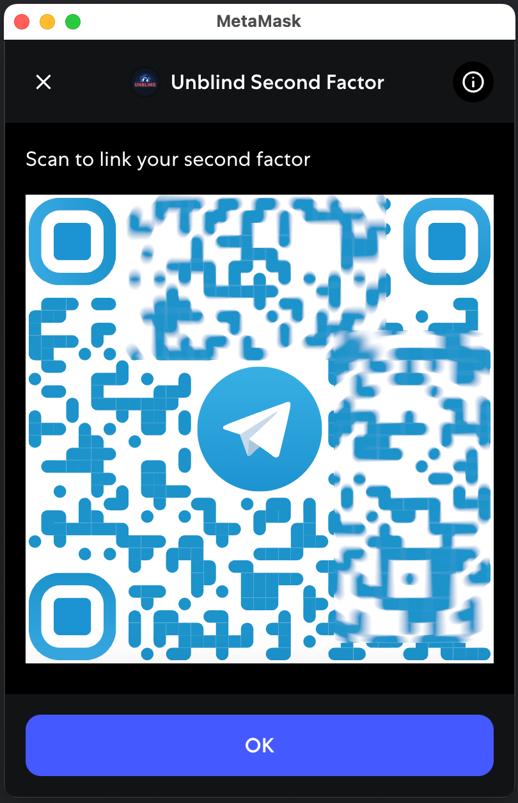
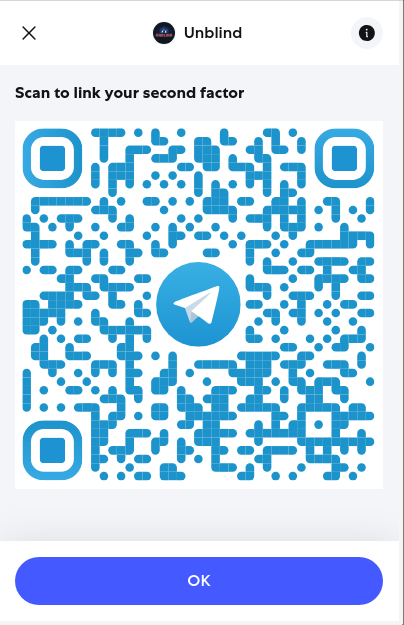
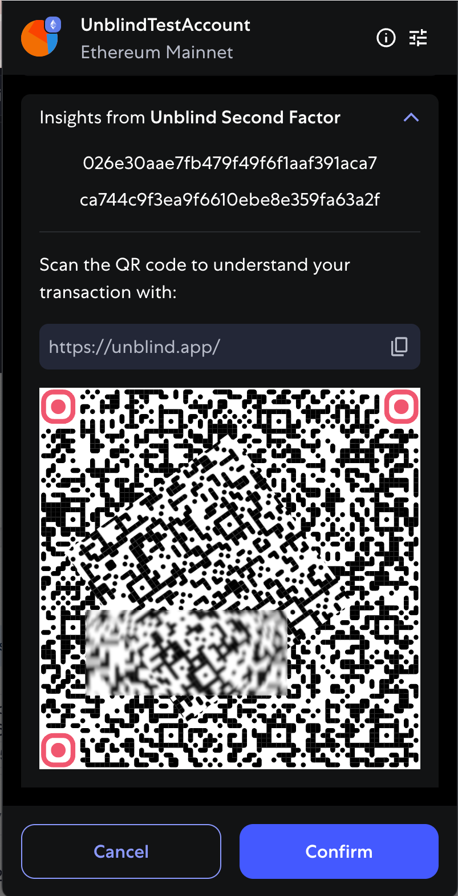
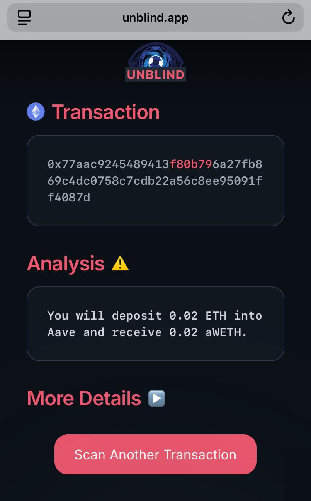
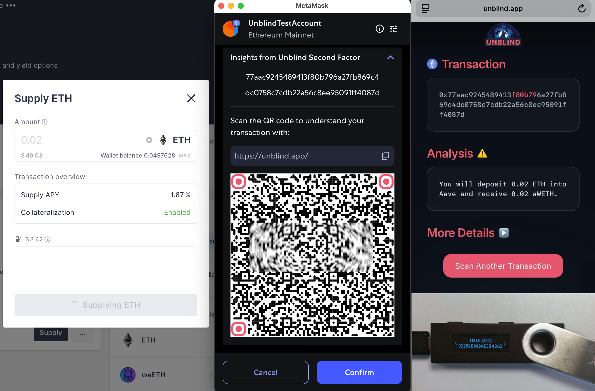

# Semantic Second Factor Snap

**Human-readable transaction insights. Hardware-wallet compatible. Telegram-optional.**

---

## ✨ Overview

Semantic Second Factor Snap is a MetaMask Snap that acts as a semantic second factor for transaction and message signing. It provides out-of-band, human-readable digests of signing requests, sent to your Telegram or shown as a QR code, so you can verify what you're about to sign—even if your browser or dApp is compromised.

---

- **Out-of-band verification:** Human-readable digests sent to your Telegram or shown as a QR code.
- **Hardware wallet compatible:** Compare the signing hash in the digest with your hardware wallet for extra security.
- **Privacy mode:** Use QR-only mode for maximum privacy—no data sent to Telegram.
- **Companion mobile app:** Scan QR codes on a separate device for air-gapped verification.
- **Reduces trust in dApp/browser:** Even if your browser or MetaMask is compromised, you get an independent, semantic summary of what you're signing.

---

## Why This Matters

Browser wallets and dApps can be compromised. This Snap gives you:
- An out-of-band channel (Telegram or QR) for verifying signing intent.
- A human-readable summary of the signing request (not just hex blobs).
- Optional hardware wallet hash matching for even stronger verification.
- A way to inspect and audit your transactions before approving.

---

## How It Works

1. **Install the Snap** and pair with your Telegram account by scanning a QR code.
2. **On every sign request** (transaction or message), the Snap sends the data to our secure backend for analysis.
3. **Receive a digest**: A natural-language summary is sent to your Telegram or shown as a QR code.
4. **Verify the digest** (and optionally the signing hash with your hardware wallet).
5. **Approve or reject** the request in MetaMask as usual.

---

## Installation

1. **Enable MetaMask Snaps** (requires MetaMask Flask or compatible release).
2. **Install this Snap** from our repo.
3. **Pair with Telegram**: On first run, you'll be shown a QR code to link your Telegram account with our bot.

*Once paired, you're ready to go!*

---

## Usage

- **Telegram Mode:**  
  - One-time QR scan links your wallet to your Telegram account.
  - Human-readable digests appear via our bot.
  - Great UX for everyday use.

- **QR-Only Mode (Private Mode):**  
  - No data sent over Telegram.
  - A QR code appears during each signing request.
  - Scan it using our open-source mobile app on a separate device.
  - Ideal for high-privacy workflows or air-gapped setups.

- **Hardware Wallets:**  
  - Compare the signing hash in the digest with the hash shown on your hardware wallet for maximum confidence.

---

## Screenshots

### 1. Connect Your Telegram for Second Factor Notifications

  

<em>Scan this QR code in MetaMask to link your Telegram account and receive second factor notifications for your blockchain transactions.</em>

---

### 2. Receive Human-Readable Transaction Summaries

  

<em>Example of a human-readable digest sent to your Telegram, so you can understand what you are signing before you approve.</em>

---

### 3. Prefer Not to Use Telegram? Use Our Mobile App

  

<em>Instead of Telegram, you can scan the QR code with our <a href="https://unblind.app">online app</a> from your mobile device for out-of-band verification.</em>

---

### 4. View the Signing Request Explanation in the App

  

<em>The mobile app will show a clear explanation of the signing request. No Telegram required.</em>

---

### 5. Hardware Wallet Hash Comparison

  

<em>Compare the hash in the digest with your hardware wallet for maximum security.</em>

---

## Feedback & Contributions

We welcome your feedback, questions, and contributions!

- **Found a bug or have a feature request?**
  - Please [open an issue](https://github.com/BitFinding/snap/issues) on GitHub.
- **Need help or want to discuss ideas?**
  - Join the conversation via [Telegram](https://t.me/+pe-RvyED10M0Y2E8) or reach out to us on [X (Twitter)](https://x.com/BitFinding).

Your input helps us make this project better for everyone. Thank you for being part of the community!

---

## License

This project is licensed under the MIT License. See the [LICENSE](LICENSE) file for more details.

