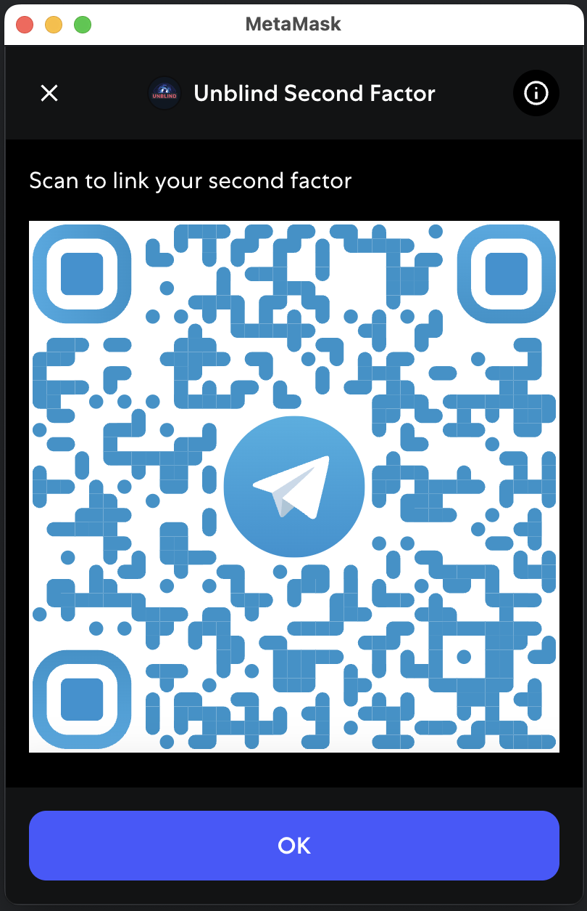

# Semantic Second Factor Snap

**Human-readable transaction insights. Hardware-wallet compatible. Telegram-optional.**

---

## ✨ Overview

Semantic Second Factor Snap is a MetaMask Snap that acts as a semantic second factor for transaction and message signing. It provides out-of-band, human-readable digests of signing requests, sent to your Telegram or shown as a QR code, so you can verify what you’re about to sign—even if your browser or dApp is compromised.

---

## Table of Contents

- [Features](#features)
- [Why This Matters](#why-this-matters)
- [How It Works](#how-it-works)
- [Installation](#installation)
- [Usage](#usage)
- [Screenshots & GIFs](#screenshots--gifs)
- [Example Flows](#example-flows)
- [Configuration](#configuration)
- [Related Work](#related-work)
- [Feedback & Contributions](#feedback--contributions)
- [License](#license)

---

## Features

- **Out-of-band verification:** Human-readable digests sent to your Telegram or shown as a QR code.
- **Hardware wallet compatible:** Compare the signing hash in the digest with your hardware wallet for extra security.
- **Privacy mode:** Use QR-only mode for maximum privacy—no data sent to Telegram.
- **Companion mobile app:** Scan QR codes on a separate device for air-gapped verification.
- **Reduces trust in dApp/browser:** Even if your browser or MetaMask is compromised, you get an independent, semantic summary of what you’re signing.

---

## Why This Matters

Browser wallets and dApps can be compromised. This Snap gives you:
- An out-of-band channel (Telegram or QR) for verifying signing intent.
- A human-readable summary of the signing request (not just hex blobs).
- Optional hardware wallet hash matching for even stronger verification.
- A way to inspect and audit your transactions before approving.

---

## How It Works

1. **Install the Snap** and pair with your Telegram account by scanning a QR code.
2. **On every sign request** (transaction or message), the Snap sends the data to our secure backend for analysis.
3. **Receive a digest**: A natural-language summary is sent to your Telegram or shown as a QR code.
4. **Verify the digest** (and optionally the signing hash with your hardware wallet).
5. **Approve or reject** the request in MetaMask as usual.

---

## Installation

1. **Enable MetaMask Snaps** (requires MetaMask Flask or compatible release).
2. **Install this Snap** from our repo.
3. **Pair with Telegram**: On first run, you’ll be shown a QR code to link your Telegram account with our bot.

*Once paired, you’re ready to go!*

---

## Usage

- **Telegram Mode:**  
  - One-time QR scan links your wallet to your Telegram account.
  - Human-readable digests appear via our bot.
  - Great UX for everyday use.

- **QR-Only Mode (Private Mode):**  
  - No data sent over Telegram.
  - A QR code appears during each signing request.
  - Scan it using our open-source mobile app on a separate device.
  - Ideal for high-privacy workflows or air-gapped setups.

- **Hardware Wallets:**  
  - Compare the signing hash in the digest with the hash shown on your hardware wallet for maximum confidence.

---

## Screenshots & GIFs

> **Please add the following artifacts for a richer README:**
> - **Pairing QR code** (shown at install)
> - **Telegram digest** (what the user sees in Telegram)
> - **QR code at signing** (for privacy mode)
> - **Mobile app scanning QR** (optional)
> - **Hardware wallet hash comparison** (optional)
> - **GIF:** End-to-end flow (optional)

*Scan this QR code in MetaMask to link your Telegram account.*

*Example of a human-readable digest sent to Telegram.*

*QR code shown for privacy mode.*

*Scan the QR code with our companion app for out-of-band verification.*

*Compare the hash in the digest with your hardware wallet.*

---

## Example Flows

> **Add screenshots or code snippets here to show:**
> - Signing a transaction and receiving a digest in Telegram.
> - Using QR-only mode and scanning with the mobile app.
> - Verifying a signing hash with a hardware wallet.

---

## Configuration

*Coming soon: support for custom destinations, digest formats, and alternate communication channels.*

---

## Related Work

Inspired by [Semantic Signing](https://bitfinding.com/blog/semantic-second-factor) and designed to complement hardware wallets.

This Snap offers similar goals to [Wallet Guard Snap](https://github.com/wallet-guard/wallet-guard-snap), but emphasizes out-of-band communication, hash matching, and semantic context.

---

## Feedback & Contributions

We welcome feedback, issue reports, and contributions!  
Open a GitHub issue or contact us via Telegram through the bot.

---

## License

[MIT](../../LICENSE.MIT0) or [Apache 2.0](../../LICENSE.APACHE2) (choose one or both as appropriate).

---

*Let me know when you have screenshots or if you want to add more technical details, and I’ll update the README accordingly!*